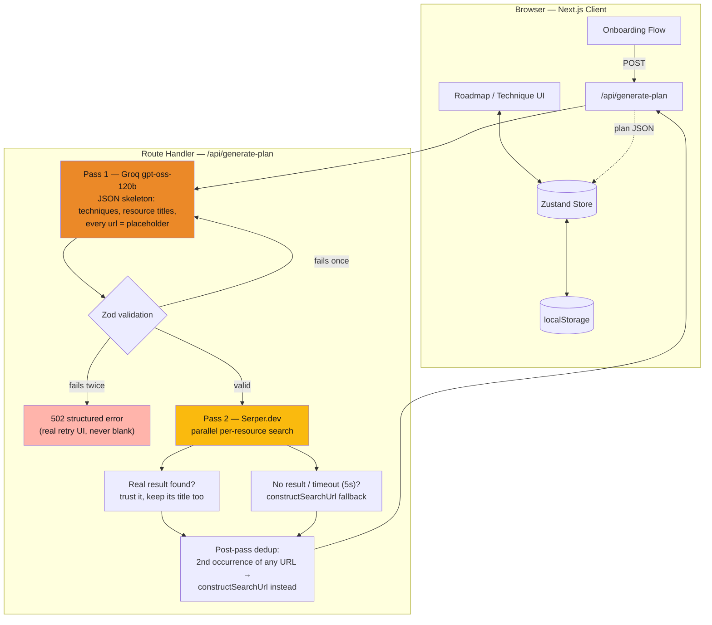

<h1 align="center">
  <br>
  
  <br>
  Whittle
  <br>
</h1>

<h4 align="center">Pick a hobby. Get a 5-8 step learning roadmap — curated and personalized to your level and goal, not another endless YouTube search.</h4>

<p align="center">
  
  
  
  
  
</p>

<p align="center">
  <a href="#live-demo--walkthrough">Live Demo</a> •
  <a href="#key-features">Key Features</a> •
  <a href="#architecture">Architecture</a> •
  <a href="#tech-stack">Tech Stack</a> •
  <a href="#running-locally">Running Locally</a>
</p>

---

## What Whittle Does

Most hobby-learning content is a firehose — endless videos, no sense of what actually matters first. Whittle asks for a hobby, a skill level, a goal, and how much time you have, then generates a **5-8 technique roadmap**, each technique paired with 1-3 real resources (video, reading, or audio — matched to what the technique actually needs, never audio-only for something that requires seeing physical form). You mark each technique **mastered** as you go, or **skip** it — skipping is reversible, not a failure state.

There are no accounts and no backend database. That's a deliberate call, not a missing feature: a single-user, no-history hobby tracker doesn't need auth or a server to own state, so the one thing that actually matters — not losing your plan when you close the tab — is handled with `localStorage` persistence instead, and the engineering effort goes into the parts that are actually hard (the AI pipeline, the fallback handling, the responsive UI patterns).

## Live Demo & Walkthrough

- **Live demo:** _coming soon_
- **Loom walkthrough:** _coming soon_

## Key Features

- **AI-generated, personalized roadmap** — 5-8 techniques, sequenced foundational-to-advanced, tailored to stated skill level/goal/time commitment, exactly 3 resources per technique (video, reading, and one more of either)
- **Real web-search resource discovery** — every resource link comes from an actual Serper.dev (Google Search/Video API) search, not an AI-invented URL, with a constructed search-link fallback whenever a search comes up empty (see [Architecture](#architecture))
- **Full fallback chain** on AI generation — structuring retry, per-resource search fallback, a post-enrichment duplicate-URL cleanup pass, and a real error state with retry affordance; never a blank screen or raw 500
- **Mark Mastered / Skip** — skip is fully reversible via a dedicated "bring back" action, never framed as giving up
- **Winding roadmap path** (Duolingo/wondering.app-inspired), zone-grouped into thirds, with no locked nodes — every technique is always accessible, nothing gates a later one behind an earlier one
- **Mascot companion** — a Lottie-driven character reacting to real state (idle, explaining a technique, thinking, success, error), not decorative animation
- **Responsive technique detail** — desktop modal / mobile bottom sheet, the one deliberate overlay pattern in the app
- **One scoped celebration moment** on mastering a technique — no points economy, streaks, or badge systems
- **149 automated tests**, TypeScript strict mode, zero live API calls in the test suite (every provider call is mocked)

## Architecture

A decoupled two-pass pipeline: one pass invents the *plan* (Groq, from its own reasoning), a second pass finds *real, currently-live links* for it (Serper.dev, an actual Google Search/Video API) — deliberately separating "what should this plan contain" from "what real page backs each resource," instead of asking one model to do both at once.



**Why two passes instead of one search-grounded call:** this replaced an earlier Gemini-grounding-based pipeline (Google Search grounding + a second structuring call). That approach worked, but Gemini's grounding URLs turned out to be `vertexaisearch.cloud.google.com` redirect wrappers with a limited validity window, not permanent links — a real problem for a plan that persists in `localStorage` indefinitely with no refresh mechanism. The current design trades "curation informed by live search" for "strict schema adherence + permanent, directly-sourced URLs, found independently of what the LLM imagined" — Groq's own training data is treated as sufficient for hobby-curriculum sequencing, and Serper's real search results replace every resource link afterward regardless.

**Why a dedup pass instead of a duplicate-triggered retry:** two different resources' Serper searches can land on the same top result. Retrying the whole Groq generation over a link collision would burn tokens on a problem that's cheap to fix locally — so duplicates are cleaned up by walking the finished plan once and replacing any repeat URL with a constructed search link, keeping the first occurrence as the "real" one.

**Defense in depth:** every provider response is re-validated against the same Zod schema regardless of what structured-output mode was requested from it — structured output is treated as best-effort prompting, not a contract.

## Tech Stack

| Layer | Choice |
|---|---|
| Framework | Next.js 16 (App Router, Turbopack) — one project, no separate backend service |
| UI | React 19, TypeScript (strict), Tailwind CSS v4 |
| State | Zustand + `persist` middleware (`localStorage`) — the only thing that persists is one `HobbyPlan` object; everything else (progress, visible/skipped lists) is computed on read, never stored |
| Validation | Zod — request validation, AI-response schema validation, both independent of provider-side schema features |
| AI | Groq `openai/gpt-oss-120b` (plan skeleton) + Serper.dev (real per-resource search) |
| Animation | `motion` + `lottie-react`, lazy-loaded via `next/dynamic` (confirmed via build output: ~860KB of Lottie code is excluded from the required-upfront JS for the main route) |
| Overlays | `@base-ui/react` (`Dialog` for desktop, `Drawer` for mobile) |
| Testing | Vitest + React Testing Library — 149 tests, all provider calls mocked |

## Design Credit

- **[LottieFiles](https://lottiefiles.com/)** — the mascot's animation states (idle, thinking, explaining, success)
- **[Duolingo](https://www.duolingo.com/learn)** — the onboarding pacing (one focused question per screen, with a progress indicator across steps)
- **[Duolingo](https://www.duolingo.com/learn)** and **[wondering.app](https://wondering.app/)** — the winding roadmap path as a way to present a sequence of steps as a progression, rather than a flat list

## Running Locally

```bash
git clone <repo-url>
cd whittle
npm install
```

Create `.env.local` in the project root (see `.env.example`):

```
GROQ_API_KEY=your_key_here
SERPER_API_KEY=your_key_here
```

```bash
npm run dev      # start the dev server at localhost:3000
npm test         # run the test suite (149 tests, fully mocked — no live API calls)
npm run build    # production build
```
