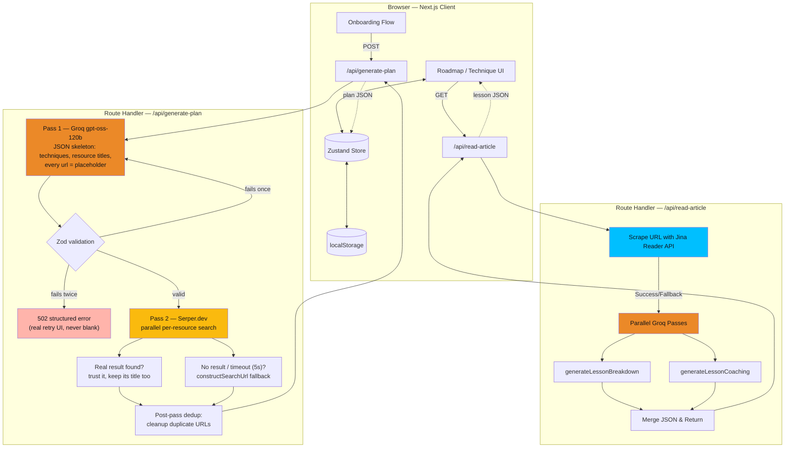

<h1 align="center">
  <br>
  
  <br>
  Whittle
  <br>
</h1>

<h4 align="center">Pick a single hobby. Get a personalized, 5-8 step learning roadmap focused on real-world practice, not another endless YouTube binge.</h4>

<p align="center">
  
  
  
  
  
</p>

<p align="center">
  <a href="#live-demo--walkthrough">Live Demo</a> •
  <a href="#merylls-learning-philosophy">Meryll's Philosophy</a> •
  <a href="#key-features">Key Features</a> •
  <a href="#recent-fixes--product-loop-post-feedback">Recent Fixes & Product Loop</a> •
  <a href="#architecture">Architecture</a> •
  <a href="#running-locally">Running Locally</a>
</p>

---

## What Whittle Does (The Single-Hobby Stance)

Most hobby-learning content is a firehose — endless videos, no sense of what actually matters first. Whittle asks for **one hobby**, a skill level, a goal, and how much time you have, then generates a **5-8 technique roadmap**, sequenced foundational-to-advanced.

We took a strict **Single-Hobby Stance**. You won't find dashboards for managing 12 different plans. You pick one thing you want to get good at, and we guide you through a linear roadmap until you master it. If you want to switch to a new hobby, you start fresh.

There are no accounts and no backend database. A single-user, no-history hobby tracker doesn't need auth or a server to own state. Your progress is saved safely to `localStorage`.

## Meryll's Learning Philosophy

Whittle is heavily inspired by Meryll's pedagogy and design philosophy, which values **intrinsic motivation and actionable, structured learning** over cheap dopamine. 

1. **The 5-Step Lesson Structure:** We don't just dump external links on you. Every technique is broken down via Just-In-Time (JIT) AI generation into a strict, digestible slide deck:
   - **Introduction:** Why does this matter?
   - **Watch & Learn:** High-quality Video & Audio (Podcast) resources embedded seamlessly.
   - **How it Works:** Step-by-step breakdown distilled directly from real articles.
   - **Watch Out For:** Common mistakes & pro tips.
   - **Master:** A final recap, key takeaways, and a place to jot down your notes.
2. **Anti-Dark Patterns & The Reward Loop:** We completely reject gamification. You will not find streaks, leaderboards, or arbitrary points economies here. Instead, we rely on a **rich, native reward loop**: 
   - Physics-based micro-animations (e.g. spring-loaded checkmarks).
   - Tactile button bounces and immediate visual feedback.
   - A **dynamic Mascot companion** who genuinely acknowledges your exact progress (*"You're 2 steps away from mastering Pickleball!"*) rather than spouting generic praise.

## Live Demo & Walkthrough

- **Live demo:** [whittle-hobbies.vercel.app](https://whittle-hobbies.vercel.app/)

## Key Features

- **AI-generated, personalized roadmap** — exactly 3 resources per technique (video, reading, and audio).
- **Real web-search resource discovery** — every resource link comes from an actual Serper.dev (Google Search/Video API) search.
- **Dynamic Mascot Companion** — a character reacting to your specific progress, giving you personalized encouragement rather than generic praise.
- **Mark Mastered / Skip** — skip is fully reversible via a dedicated "bring back" action.
- **Native responsive overlays** — the Notes panel is a side panel on desktop and a true bottom sheet on mobile.
- **281 automated tests**, TypeScript strict mode, zero live API calls in the test suite (every provider call is mocked).

## Recent Fixes & Product Loop (Post-Feedback)

Based on recent feedback, we underwent a massive polish pass to ensure the app hits a premium, native standard and closes the loop on a complete product flow:

- **Complete Native Learning Journey:** We eliminated the horrible UX of kicking users out to external links. The entire 5-step "Meryll's Philosophy" journey is now built fully in-app as a unified product loop:
  - *Slide 1 (Introduction):* JIT personalized context.
  - *Slide 2 (Watch & Learn):* Video resources play inside a native YouTube iframe embed, and Audio resources play inside our custom-built Podcast widget.
  - *Slide 3 (How It Works):* Step-by-step breakdown directly synthesized from real, scraped web articles.
  - *Slide 4 (Watch Out For):* A detailed Pros/Cons and Mistake tracker.
  - *Slide 5 (Master):* Key Takeaways with an integrated **Bonus Notes Section**—users can click any Key Takeaway to instantly save it to their personal notes before marking the lesson complete.
- **Persistent Slide Indexing:** The exact slide you are on inside a lesson is now cached in `sessionStorage`. If you accidentally refresh or close your phone, you resume exactly where you were.
- **JIT Fetching Pipeline:** Lessons (Key Takeaways, Mistakes, Steps) are generated Just-In-Time as soon as you open a technique, completely eliminating blocking wait times during the initial plan generation.
- **Improved Podcast Matching:** Added explicit "episode" constraints to our audio Serper queries, ensuring you get actual playable podcasts instead of generic search pages.
- **Light Theme & Contrast:** Ensured the default theme is a beautiful light mode ("Daylight Campfire"), completely rebuilt the Progress Bar UI to blend seamlessly, and prevented dark mode from masking important UI elements.
- **Layout & Mobile UI:** Completely eliminated layout shifts during JIT loading and centered footer navigations perfectly across all breakpoints.

## Architecture

We use a decoupled multi-pass pipeline powered by **Groq (`gpt-oss-120b`)** for lightning-fast AI reasoning, **Serper.dev** for live Google Search grounding, and **Jina Reader** for real-time web scraping.

### Pass 1: Plan Generation (`/api/generate-plan`)
One pass invents the *plan* (Groq), a second pass finds *real, currently-live links* for it (Serper.dev) — deliberately separating "what should this plan contain" from "what real page backs each resource."

### Pass 2: JIT Lesson Generation (`/api/read-article`)
When you click a lesson, we immediately scrape the article URL using the **Jina Reader API**. We then feed that raw text back to **Groq** via two highly-specific, parallel prompts to extract the Step-by-Step Breakdown and the Coaching Tips. 



## Running Locally

```bash
git clone https://github.com/Mithurn/Whittle.git
cd Whittle
npm install
```

Create `.env.local` in the project root (see `.env.example`):

```
GROQ_API_KEY=your_key_here
SERPER_API_KEY=your_key_here
```

```bash
npm run dev      # start the dev server at localhost:3000
npm test         # run the test suite (281 tests, fully mocked)
npm run build    # production build
```

## License

This project is licensed under the MIT License — see the [LICENSE](LICENSE) file for details.
