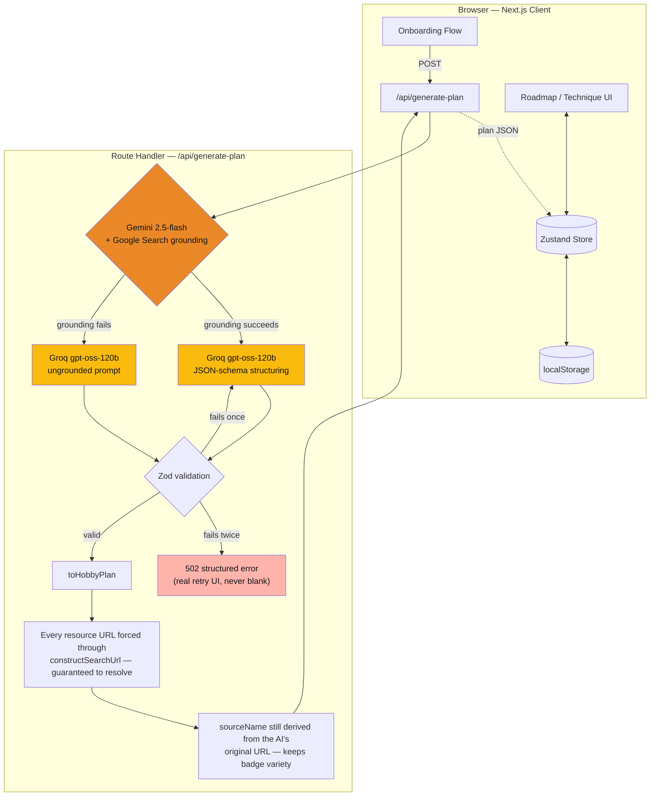

<h1 align="center">
  <br>
  
  <br>
  Whittle
  <br>
</h1>

<h4 align="center">Pick a hobby. Get a 5-8 step learning roadmap — curated and personalized to your level and goal, not another endless YouTube search.</h4>

<p align="center">
  
  
  
  
  
</p>

<p align="center">
  <a href="#live-demo--walkthrough">Live Demo</a> •
  <a href="#key-features">Key Features</a> •
  <a href="#architecture">Architecture</a> •
  <a href="#tech-stack">Tech Stack</a> •
  <a href="#running-locally">Running Locally</a>
</p>

---

## What Whittle Does

Most hobby-learning content is a firehose — endless videos, no sense of what actually matters first. Whittle asks for a hobby, a skill level, a goal, and how much time you have, then generates a **5-8 technique roadmap**, each technique paired with 1-3 real resources (video, reading, or audio — matched to what the technique actually needs, never audio-only for something that requires seeing physical form). You mark each technique **mastered** as you go, or **skip** it — skipping is reversible, not a failure state.

There are no accounts and no backend database. That's a deliberate call, not a missing feature: a single-user, no-history hobby tracker doesn't need auth or a server to own state, so the one thing that actually matters — not losing your plan when you close the tab — is handled with `localStorage` persistence instead, and the engineering effort goes into the parts that are actually hard (the AI pipeline, the fallback handling, the responsive UI patterns).

## Live Demo & Walkthrough

- **Live demo:** _coming soon_
- **Loom walkthrough:** _coming soon_

## Key Features

- **AI-generated, personalized roadmap** — 5-8 techniques, sequenced foundational-to-advanced, tailored to stated skill level/goal/time commitment
- **Real web-search grounding** for resource discovery, with every resource URL routed through a constructed, guaranteed-working search link rather than trusting a raw AI-provided one (see [Architecture](#architecture) — this was a real reliability fix, not a hypothetical)
- **Full fallback chain** on AI generation — grounding failure, structuring retry, and a real error state with retry affordance; never a blank screen or raw 500
- **Mark Mastered / Skip** — skip is fully reversible via a dedicated "bring back" action, never framed as giving up
- **Winding roadmap path** (Duolingo/wondering.app-inspired), zone-grouped into thirds, with no locked nodes — every technique is always accessible, nothing gates a later one behind an earlier one
- **Mascot companion** — a Lottie-driven character reacting to real state (idle, explaining a technique, thinking, success, error), not decorative animation
- **Responsive technique detail** — desktop modal / mobile bottom sheet, the one deliberate overlay pattern in the app
- **One scoped celebration moment** on mastering a technique — no points economy, streaks, or badge systems
- **149 automated tests**, TypeScript strict mode, zero live API calls in the test suite (every provider call is mocked)

## Architecture

Two independent free-tier AI providers, each doing the job it's actually good at, with a validated fallback at every step:



**Why two providers, not one:** Gemini's `2.5-flash` model rejects combining Google Search grounding with structured JSON output in the same request (a `400`, reproduced directly against the live API, not assumed from docs). So grounding and structuring are split into two calls — Gemini finds real resources via actual search, Groq's `gpt-oss-120b` (chosen for its ~17x lower structuring latency in a head-to-head test — ~118ms vs. ~2000ms for the equivalent Gemini call — and to keep the two calls on separate free-tier quota pools) converts that into schema-validated JSON.

**Why every resource link is a constructed search URL, even on the happy path:** grounded URLs from live search still turned out to 404 in practice. Rather than trust an AI-provided link, every resource's `url` is routed through a constructed, guaranteed-resolving search query — while `sourceName` (the badge you see, e.g. "YouTube" or "Chess.com") is still derived from the AI's original URL, so the resource variety stays visible even though the link itself is guaranteed to work.

**Defense in depth:** Groq's JSON-schema mode biases the model toward well-formed output, but the server re-validates every response against the same Zod schema regardless — provider-side structured output is treated as best-effort prompting, not a contract.

## Tech Stack

| Layer | Choice |
|---|---|
| Framework | Next.js 16 (App Router, Turbopack) — one project, no separate backend service |
| UI | React 19, TypeScript (strict), Tailwind CSS v4 |
| State | Zustand + `persist` middleware (`localStorage`) — the only thing that persists is one `HobbyPlan` object; everything else (progress, visible/skipped lists) is computed on read, never stored |
| Validation | Zod — request validation, AI-response schema validation, both independent of provider-side schema features |
| AI | Gemini 2.5-flash (Google Search grounding) + Groq `openai/gpt-oss-120b` (structuring) |
| Animation | `motion` + `lottie-react`, lazy-loaded via `next/dynamic` (confirmed via build output: ~860KB of Lottie code is excluded from the required-upfront JS for the main route) |
| Overlays | `@base-ui/react` (`Dialog` for desktop, `Drawer` for mobile) |
| Testing | Vitest + React Testing Library — 149 tests, all provider calls mocked |

## Design Credit

- **[LottieFiles](https://lottiefiles.com/)** — the mascot's animation states (idle, thinking, explaining, success)
- **[Duolingo](https://www.duolingo.com/learn)** — the onboarding pacing (one focused question per screen, with a progress indicator across steps)
- **[Duolingo](https://www.duolingo.com/learn)** and **[wondering.app](https://wondering.app/)** — the winding roadmap path as a way to present a sequence of steps as a progression, rather than a flat list

## Running Locally

```bash
git clone <repo-url>
cd whittle
npm install
```

Create `.env.local` in the project root (see `.env.example`):

```
GEMINI_API_KEY=your_key_here
GROQ_API_KEY=your_key_here
```

```bash
npm run dev      # start the dev server at localhost:3000
npm test         # run the test suite (149 tests, fully mocked — no live API calls)
npm run build    # production build
```
